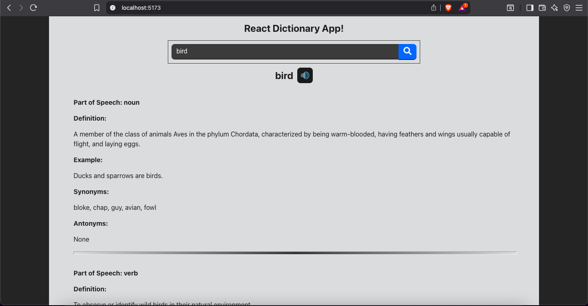
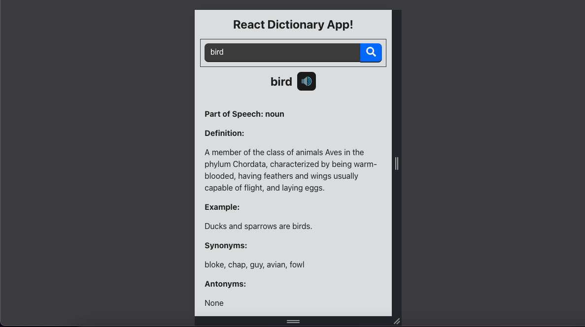

# 📘 React Dictionary App

A responsive, interactive dictionary web app built with React. It allows users to search for English words, see their meanings, listen to pronunciation, view examples, and explore synonyms/antonyms.

A sleek and simple ReactJS Dictionary App that fetches word definitions, synonyms, antonyms, examples, and pronunciation using the [Free Dictionary API](https://dictionaryapi.dev/). It includes:

- 🔍 Real-time word search
- 🔊 Audio pronunciation
- 📚 Multiple meanings display
- ⚠️ Error handling with toast notifications
- ⏳ Loading spinner for UX

---

## 🖼 Demo

> Live App 👉 [Click here to try it](https://react-dictionary-app-five.vercel.app/)

---

## 🚀 Features

- 🔍 Search any English word
- 🧠 View meanings, definitions, examples
- 🗣️ Listen to pronunciation audio
- ❌ Input validation with error toasts
- 📉 API failure and no-result handling
- ⏳ Loading spinner with smooth UX
- 🧼 Debounced search (prevents spamming API)
- ♿ Accessible (screen-reader friendly buttons)
- 📱 Fully responsive design for mobile/tablet

---

## 🛠️ Tech Stack

| Tech          | Description                    |
|---------------|--------------------------------|
| React         | Frontend UI                    |
| Axios         | API Calls                      |
| React Toastify| Notification handling          |
| React Icons   | Speaker icon and search icon   |
| React Loader Spinner | Loader animation         |
| CSS           | Styling                        |


- **Frontend:** React, CSS
- **Libraries:** 
  - [`react-icons`](https://react-icons.github.io/react-icons/)
  - [`react-toastify`](https://fkhadra.github.io/react-toastify/)
  - [`react-loader-spinner`](https://mhnpd.github.io/react-loader-spinner/)
  - [`lodash.debounce`](https://lodash.com/docs/#debounce)
- **API:** [Free Dictionary API](https://dictionaryapi.dev/)
- **Deployment:** [Vercel](https://vercel.com/)
---

## 📦 Installation

### 1. Clone the Repository
```bash
git clone https://github.com/your-username/react-dictionary-app.git
cd react-dictionary-app
```

### 2. Install Dependencies
```bash
npm install
```

### 3. Start the App
```bash
npm run dev
```
Now open http://localhost:5173 in your browser.

---

## 🔧 File Structure
```css
src/
├── Components/
│   ├── Dictionary/
│   │   ├── Dictionary.jsx
│   │   └── Dictionary.css
│   └── SearchBox/
│       ├── SearchBox.jsx
│       └── SearchBox.css
├── App.jsx
├── App.css
├── main.jsx
└── index.css
```

---

## 📸 Screenshots


> Desktop View


> Mobile View

---

## 🧪 Tested Searches
| Search Word | Result                              |
| ----------- | ----------------------------------- |
| `Ananya`    | ✖ No result (404 handled)           |
| `Bird`      | ✅ Multiple meanings + pronunciation |

---

## 🌐 API Used
- Free Dictionary API

---

## 💡 Future Improvements
- Light/Dark mode toggle
- Save recent/favorite searches
- Multi-language support

---

## 📄 License
This project is open-source and available under the MIT License.

---

## 🧑‍💻 Author
Made with ❤️ by [Surender Gupta](https://linkedin.com/in/surender-gupta)

